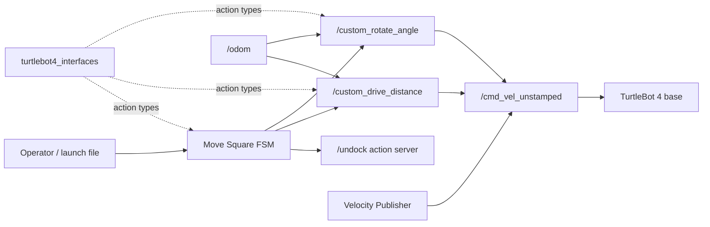

# TurtleBot 4 Autonomy

A ROS 2 workspace for learning and developing autonomous motion behaviors on the TurtleBot 4. The project provides reusable odometry-based motion controllers, custom ROS 2 actions, and a finite-state machine (FSM) that coordinates the robot to drive a square.

> [!CAUTION]
> Test motion commands in simulation first. When using real hardware, keep the robot in a clear area and be ready to stop it.

## Features

- Configurable linear and angular velocity publisher
- Odometry-based drive-distance and rotate-angle controllers
- Custom ROS 2 action definitions with feedback and cancellation support
- Action servers with input validation, odometry freshness checks, and safe-stop behavior
- Asynchronous square-motion FSM with automatic undocking
- Launch support for simulation time
- ROS 2 lint and package tests

## Repository structure

```text
.
├── docs/                         # Extended documentation and image assets
│   └── images/
├── src/
│   ├── turtlebot4_controller/    # Python nodes, action servers, FSM, and launch files
│   └── turtlebot4_interfaces/    # Custom DriveDistance and RotateAngle actions
├── videos/                       # Demo video and GIF sources
├── CHANGELOG.md
├── CONTRIBUTING.md
├── LICENSE
└── README.md
```

## Architecture



The standalone controllers and velocity publisher are useful for individual experiments. The `move_square` node uses the action servers instead, sequencing undocking, translation, and rotation without embedding the low-level controller logic in the FSM.

## Dependencies

- Ubuntu with [ROS 2 Jazzy](https://docs.ros.org/en/jazzy/Installation.html) or a compatible ROS 2 distribution
- TurtleBot 4 packages and either a TurtleBot 4 robot or simulator
- `colcon` and the ROS dependency manager (`rosdep`)
- Python 3
- ROS packages used directly by this workspace:
  - `rclpy`
  - `geometry_msgs`
  - `nav_msgs`
  - `action_msgs`
  - `irobot_create_msgs`
  - `rosidl_default_generators`

The examples below assume ROS 2 Jazzy and a Bash shell. Replace `jazzy` if you use another supported distribution.

## Installation

Clone this repository as a workspace, install dependencies, and source ROS 2:

```bash
git clone <repository-url> turtlebot4_autonomy_ws
cd turtlebot4_autonomy_ws
source /opt/ros/jazzy/setup.bash
sudo rosdep init  # Run once per machine; skip if already initialized.
rosdep update
rosdep install --from-paths src --ignore-src --rosdistro jazzy -y
```

Install and start the official TurtleBot 4 simulator or connect to a configured robot before launching motion nodes. Those platform-specific steps are maintained by the TurtleBot 4 project.

## Build

From the repository root:

```bash
source /opt/ros/jazzy/setup.bash
colcon build --symlink-install
source install/setup.bash
```

To run the package tests:

```bash
colcon test --event-handlers console_direct+
colcon test-result --verbose
```

## Launch and usage

Start the TurtleBot 4 simulator or robot drivers in a separate terminal, then source this workspace in every new terminal.

Launch the complete square behavior in simulation:

```bash
source install/setup.bash
ros2 launch turtlebot4_controller move_square.launch.py use_sim_time:=true
```

For a physical robot, use wall-clock time:

```bash
ros2 launch turtlebot4_controller move_square.launch.py use_sim_time:=false
```

Override FSM parameters as needed:

```bash
ros2 run turtlebot4_controller move_square --ros-args \
  -p side_length:=0.5 \
  -p turn_angle_degrees:=90.0 \
  -p max_translation_speed:=0.15 \
  -p max_rotation_speed:=0.4
```

Standalone examples:

```bash
# Publish a constant velocity until interrupted.
ros2 run turtlebot4_controller velocity_publisher --ros-args -p linear_speed:=0.1

# Drive 1 metre using odometry feedback.
ros2 run turtlebot4_controller drive_distance --ros-args -p target_distance:=1.0

# Rotate 90 degrees using odometry feedback.
ros2 run turtlebot4_controller rotate_angle --ros-args -p target_angle_degrees:=90.0
```

The square launch file starts both custom motion action servers automatically. To inspect their interfaces after building, run:

```bash
ros2 interface show turtlebot4_interfaces/action/DriveDistance
ros2 interface show turtlebot4_interfaces/action/RotateAngle
```

## Packages

### `turtlebot4_controller`

An `ament_python` package containing the velocity publisher, standalone odometry controllers, cancellable action servers, the square-motion FSM, and the combined launch file. Motion settings are exposed as ROS parameters.

### `turtlebot4_interfaces`

An `ament_cmake` interface package that generates the `DriveDistance` and `RotateAngle` action types. Each action defines a goal, completion result, and live controller feedback.

## Project status

This project is in an early public-development stage. The core motion-control learning milestones are implemented and buildable, but the workspace is not yet a complete autonomous navigation stack. Interfaces and parameters may evolve before a stable 1.0 release.

## Roadmap

Completed:

- ✅ Velocity Publisher
- ✅ Drive Distance Controller
- ✅ Rotate Angle Controller
- ✅ Custom ROS2 Actions
- ✅ Move Square FSM

Planned:

- LiDAR Processing
- Obstacle Detection
- Reactive Navigation
- Wall Following
- Mapping
- Navigation2 Integration

## Screenshots and demos

Screenshots and diagrams will be stored in [`docs/images`](docs/images/README.md). Demo recordings and GIF source files will be stored in [`videos`](videos/README.md).

<!-- Replace these placeholders when media is available. -->

| Simulation | Square-motion demo |
| --- | --- |
| _Screenshot coming soon_ | _GIF coming soon_ |

## Contributing

Small, focused contributions are welcome. Please read [CONTRIBUTING.md](CONTRIBUTING.md) before opening an issue or pull request.

## License

This project is licensed under the MIT License. See [LICENSE](LICENSE) for details.

## Author

Carlos
